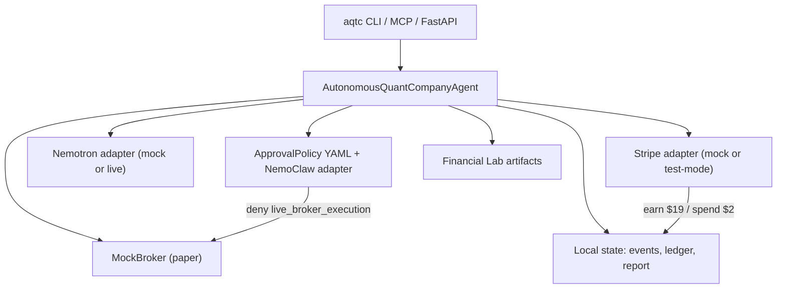

# Autonomous Quant Company

[](https://github.com/gris/autonomous-quant-company/actions/workflows/ci.yml)

A Hermes-powered autonomous quantitative research company for the NVIDIA × Stripe × Nous Research Hermes Agent Accelerated Business Hackathon.

The agent runs a safe paper-trading business loop:

1. buys the data/compute it needs through a Stripe-style ledger,
2. validates strategies with Financial Lab walkforward evidence,
3. rejects unsafe strategies instead of hiding bad results,
4. requests a NemoClaw-style approval before paper execution,
5. updates a paper portfolio through a MockBroker,
6. generates a customer report, and
7. records revenue for that report.

This is not investment advice and does not execute live trades by default. It is a business-operations demo for autonomous financial research.

## Architecture



## Why it fits the hackathon

- **Earn:** the agent bills for generated quantitative research reports ($19 in the demo).
- **Spend:** the agent spends from a bounded budget for market data/compute ($2 in the demo).
- **Run operations:** validation, risk review, paper execution, reporting, and ledger updates.
- **NVIDIA alignment:** Nemotron/NemoClaw integration points are explicit; mock is the default.
- **Stripe alignment:** Stripe Skills boundaries are explicit; mock ledger by default, test-mode PaymentIntents when configured.

## Verified Financial Lab evidence included

- production walkforward: mean Sharpe **3.255**, 5/5 folds positive, mean max drawdown **0.032**
- rejected 2019+ ensemble: Sharpe **-0.544**, max drawdown **0.486**
- live paper signals and canonical production config under `data/demo/`

## Demo results (deterministic mock mode)

- Strategy accepted: **True**
- Unsafe ensemble rejected: **True**
- Trade approval: **approved** (paper rebalance)
- Ledger: spend **$2**, earn **$19**, net **$17**
- Gross exposure capped at **4.0**

**Revenue note:** mock mode records ledger entries locally. Stripe test mode creates real test PaymentIntents; when `STRIPE_SECRET_KEY` is set they are confirmed with `pm_card_visa` and logged as `succeeded`. Without a key, test-mode adapters fall back to mock ledger entries.

## Quick start

```bash
python -m pip install -e ".[dev,api,mcp,live]"
pytest -q --cov=aqtc
aqtc demo
```

Expected output includes `Net operating result: $17.00`.

Docker:

```bash
docker compose up demo
# optional API + dashboard at http://127.0.0.1:8010/
docker compose up api
```

## Commands

```bash
aqtc demo                    # run deterministic business cycle
aqtc demo --json             # machine-readable result
aqtc demo --approve-spend    # bypass human approval for large spends
aqtc status                  # local state/event ledger
aqtc report --out report.md  # copy existing report (non-destructive)
aqtc report --run --out report.md  # regenerate then copy
make serve                   # FastAPI dashboard on :8010
```

## Safety defaults

- live trading disabled (`AQTC_LIVE_TRADING=false`)
- `live_broker_execution` denied in `examples/approval_policy.yaml`
- daily budget and approval thresholds canonical in YAML (env override only when set)
- spend above threshold requires human approval unless `--approve-spend` / `AQTC_AUTO_APPROVE_SPEND`
- paper MockBroker only in P0

See [docs/REAL_VS_MOCK.md](docs/REAL_VS_MOCK.md) for integration details.

## Live quickstart (optional)

```bash
export STRIPE_SECRET_KEY=sk_test_...
aqtc demo --stripe-mode stripe_test --json

export OPENROUTER_API_KEY=...
aqtc regime --provider openrouter --json
aqtc demo --nvidia-mode openrouter --json
```

`auto` tries OpenRouter → NVIDIA NIM → OpenCode Zen → mock. Explicit providers without keys return `{provider}-unavailable`.

## MCP server

```bash
aqtc-mcp
fastmcp call src/aqtc/mcp_server.py aqtc_get_report --json
```

## Development

```bash
make install-all
make lint
make typecheck
make test
make smoke
```

## Roadmap

- P0: deterministic local demo, tests, curated Financial Lab artifacts ✅
- P1: Stripe test-mode adapter, Nemotron live adapter ✅
- P2: dashboard lite, Docker compose, MCP server ✅
- P3: public readiness, video script, submission assets
