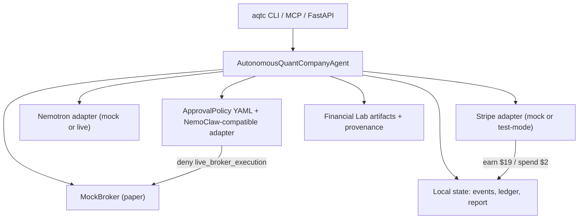

# Autonomous Quant Company

**No es prompt trading. Es alpha evolucionado por Financial Lab, validado por walkforward, operado por Hermes como una micro-compañía cuantitativa auditable.**
**Scientific integrity first:** AQTC leads with falsification — the 2019+ ensemble is **rejected** (Sharpe **-0.544**) before HGAT+ES v4 (Sharpe **3.255**, **5/5** folds) is promoted. Bad alpha is surfaced in the demo, report, and dashboard, not hidden.

*From evolved alpha to invoice.* — HGAT+ES alpha, Hermes operations, Stripe revenue.

A Hermes-powered autonomous quantitative research company for the NVIDIA × Stripe × Nous Research Hermes Agent Accelerated Business Hackathon.

## What makes this different

| Typical AI trading demo | AQTC |
|-------------------------|------|
| Prompt → signal → chart | Financial Lab **HGAT+ES v4** alpha with frozen walkforward evidence |
| Hides bad backtests | **Rejects** failed candidates (2019+ ensemble Sharpe **-0.544**) |
| No business loop | Buys data, validates, approves, paper-trades, **bills $19** via Stripe |
| Black box | Full provenance: `aqtc provenance --json`, MCP, API `/provenance` |

**Key principle:** ES is verifiable alpha origin/provenance — not heavy live training in the demo.

**Why a heterogeneous graph + Evolution Strategies** (not prompt trading, not backprop/PPO)? See **[docs/WHY_HGAT_ES.md](docs/WHY_HGAT_ES.md)** — typed `stock`/`commodity`/`macro`/`risk` nodes, the non-differentiable cost-aware reward that rules out gradients, the 19D genotype, and the byte-identical SHA-256 provenance anchor.

**vs SOLVENT:** SOLVENT sells research briefs; AQTC sells evolved alpha proven with 5-fold walkforward.

## Verified Financial Lab evidence

Curated artifacts under `data/demo/` — no runtime ES training:

| Metric | Accepted (HGAT+ES v4) | Rejected (2019+ ensemble) |
|--------|----------------------|---------------------------|
| Mean Sharpe | **3.255** | **-0.544** |
| Walkforward folds | 5 (100% positive) | — |
| Mean max drawdown | **0.032** | **0.486** |
| Genotype φ | 19D | — |

```bash
aqtc provenance          # human-readable provenance summary
aqtc provenance --json   # machine-readable
```

**Read the engine, not just the number.** The HGAT+ES architecture, ES trainer, and walkforward validator that produced this evidence are published as a curated, MIT-licensed reference: **[github.com/Grizaceo/financial-lab-reference](https://github.com/Grizaceo/financial-lab-reference)**. Its `production.toml` and `walkforward_report.json` are byte-identical (SHA-256) to the copies here — provenance you can open and read, not just trust.

## Business loop

The agent runs a safe paper-trading business cycle:

1. buys the data/compute it needs through a Stripe-style ledger,
2. validates strategies with Financial Lab walkforward evidence,
3. rejects unsafe strategies instead of hiding bad results,
4. requests NemoClaw-compatible policy approval before paper execution,
5. updates a paper portfolio through a MockBroker,
6. generates a customer report, and
7. records revenue for that report.

This is not investment advice and does not execute live trades by default.

## Architecture



## Demo results (deterministic mock mode)

- Strategy accepted: **True**
- Unsafe ensemble rejected: **True**
- Trade approval: **approved** (paper rebalance)
- Ledger: spend **$2**, earn **$19**, net **$17**
- Gross exposure capped at **4.0**

**Stripe test:** redacted PaymentIntent proof shows **succeeded** (`docs/proof/stripe_test_paymentintent_redacted.json`).

**Revenue note:** mock mode records ledger entries locally. Stripe test mode creates real test PaymentIntents; when `STRIPE_SECRET_KEY` is set they are confirmed with `pm_card_visa` and logged as `succeeded`. Capture instructions and generated redacted proof location: [docs/proof/](docs/proof/).

## Judge quick reference

- [Judge one-pager](docs/JUDGE_ONE_PAGER.md) — five claims with file-path evidence
- [Proof manifest](data/demo/proof_manifest.generated.json) — SHA-256 hashes for alpha/proof artifacts (`python scripts/generate_proof_manifest.py` to regenerate)
- Stripe test proof generated at `docs/proof/stripe_test_paymentintent_redacted.json` (regenerate with `bash scripts/capture_stripe_proof.sh` when `STRIPE_SECRET_KEY` is set)
- All alpha artifacts are hash-addressed via the proof manifest

## Why this is not prompt trading

AQTC does not map natural-language prompts to trades. Production alpha comes from frozen **Financial Lab HGAT+ES v4** walkforward artifacts (`data/demo/walkforward_report.json`, `production.toml`, `manifest.json`). The demo validates pre-computed evidence, compares against a known-bad ensemble, and operates a paper portfolio — inspect with `aqtc provenance --json`.

## Regulatory safety

- Research and education demo only — **not investment advice**
- No live broker execution by default (`live_broker_execution` denied in `examples/approval_policy.yaml`)
- Paper **MockBroker** only; `AQTC_LIVE_TRADING=false`
- Human approval required for spend above threshold unless `--approve-spend`
- Designed for OpenShell deployment with a NemoClaw-compatible policy adapter; demo uses local deterministic guardrails

See [docs/SAFETY_AND_COMPLIANCE.md](docs/SAFETY_AND_COMPLIANCE.md).

## Quick start

```bash
python -m pip install -e ".[dev,api,mcp,live]"
pytest -q --cov=aqtc
aqtc demo
```

Expected output includes `Net operating result: $17.00`.

Docker:

```bash
docker compose up demo
# optional API + dashboard at http://127.0.0.1:8010/
docker compose up api
```

## Commands

```bash
aqtc demo                    # run deterministic business cycle
aqtc demo --json             # machine-readable result
aqtc provenance              # Financial Lab alpha provenance
aqtc provenance --json
aqtc demo --approve-spend    # bypass human approval for large spends
aqtc status                  # local state/event ledger
aqtc report --out report.md  # copy existing report (non-destructive)
aqtc report --run --out report.md  # regenerate then copy
make serve                   # FastAPI dashboard on :8010
```

## Safety defaults

- live trading disabled (`AQTC_LIVE_TRADING=false`)
- `live_broker_execution` denied in `examples/approval_policy.yaml`
- daily budget and approval thresholds canonical in YAML (env override only when set)
- spend above threshold requires human approval unless `--approve-spend` / `AQTC_AUTO_APPROVE_SPEND`
- paper MockBroker only

See [docs/REAL_VS_MOCK.md](docs/REAL_VS_MOCK.md) and [docs/ALPHA_PROVENANCE.md](docs/ALPHA_PROVENANCE.md).

## Live quickstart (optional)

```bash
export STRIPE_SECRET_KEY=<your-stripe-test-secret-key>
aqtc demo --stripe-mode stripe_test --json

export OPENROUTER_API_KEY=...
aqtc regime --provider openrouter --json
aqtc demo --nvidia-mode openrouter --json
```

## MCP server

```bash
aqtc-mcp
fastmcp call src/aqtc/mcp_server.py aqtc_get_provenance --json
fastmcp call src/aqtc/mcp_server.py aqtc_get_report --json
```

## Development

```bash
make install-all
make lint
make typecheck
make test
make smoke
bash scripts/judge_smoke.sh
bash scripts/reproduce_submission.sh   # full submission rehearsal
```
